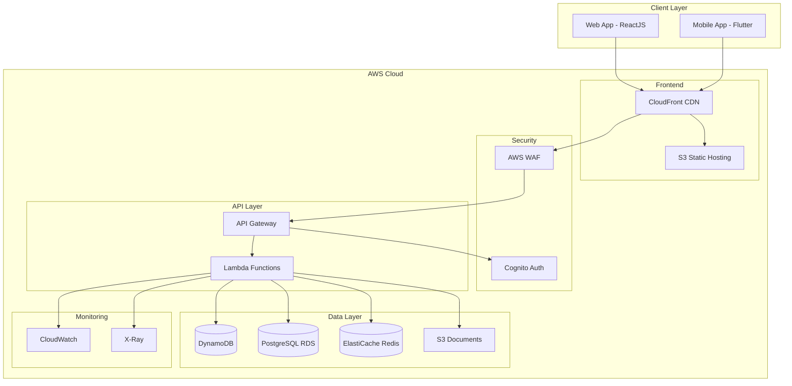

Let me create a comprehensive technical architecture document for your real estate management platform.


# Real Estate Portfolio Management Platform
## Technical Architecture & Implementation Specification

### 1. System Overview
The Real Estate Portfolio Management Platform is a comprehensive solution designed to help property owners manage their real estate investments efficiently. The system comprises a web application (ReactJS), mobile application (Flutter), and a serverless backend infrastructure (AWS/Python).

### 2. Core Features
#### Property Management
- Property portfolio dashboard
- Property details and documentation storage
- Unit/tenant management
- Occupancy tracking
- Property performance metrics

#### Financial Management
- Rent collection and tracking
- Expense management
- Maintenance cost tracking
- Automated payment processing
- Financial performance dashboards

#### Tax Management
- Automated tax document generation
- Income and expense categorization
- Tax year reporting
- Document storage for receipts and invoices
- Export capabilities for common tax software

#### Maintenance Management
- Maintenance request tracking
- Vendor management
- Work order creation and tracking
- Maintenance history
- Cost tracking and reporting

### 3. Enhanced Features
#### Analytics & Reporting
- Custom report builder
- Market analysis integration
- ROI calculations
- Predictive maintenance modeling
- Cash flow forecasting

#### Integration Capabilities
- Bank account integration
- Property listing platforms integration
- Tax software export
- Smart home device integration
- Document signing services

#### Automation Features
- Automated rent collection
- Late payment reminders
- Lease renewal notifications
- Maintenance schedule automation
- Tax document preparation

### 4. Technical Architecture

#### Backend Infrastructure (AWS)
- **API Layer**: AWS API Gateway + Lambda
- **Computing**: AWS Lambda (Python 3.11)
- **Database**: 
  - Primary: Amazon DynamoDB (NoSQL for performance)
  - Analytics: Amazon RDS (PostgreSQL for complex queries)
  - Cache: Amazon ElastiCache (Redis)
- **Storage**: 
  - Amazon S3 (documents, images)
  - Amazon EFS (for Lambda shared storage)
- **Authentication**: Amazon Cognito
- **CDN**: Amazon CloudFront

#### Backend Services (Python)
- FastAPI framework for RESTful APIs
- Pydantic for data validation
- Boto3 for AWS services integration
- SQLAlchemy for database operations
- Python-Jose for JWT handling

#### Frontend Web (ReactJS)
- Next.js framework
- Redux Toolkit for state management
- TailwindCSS for styling
- React Query for data fetching
- React Hook Form for form management

#### Mobile App (Flutter)
- BLoC pattern for state management
- GetIt for dependency injection
- Dio for HTTP client
- Hive for local storage
- Flutter Secure Storage for sensitive data

### 5. Security Implementation
- AWS WAF for web application firewall
- AWS Shield for DDoS protection
- SSL/TLS encryption for all communications
- JWT-based authentication
- Role-based access control (RBAC)
- Data encryption at rest and in transit
- Regular security audits and penetration testing

### 6. Performance Optimization
- CDN implementation for static assets
- Database query optimization
- Caching strategy:
  - Application-level caching
  - API response caching
  - Database query caching
- Lazy loading for images and components
- Code splitting and bundling optimization

### 7. Cost Optimization Strategies
- Serverless architecture to minimize infrastructure costs
- Auto-scaling configurations
- Reserved instances for predictable workloads
- S3 lifecycle policies for data archival
- Cache optimization to reduce database calls
- CDN caching to reduce origin requests

### 8. Monitoring and Maintenance
- AWS CloudWatch for monitoring and alerts
- AWS X-Ray for distributed tracing
- Error tracking and logging
- Performance monitoring
- Automated backup systems
- Disaster recovery planning




I'll create the database schemas and API contract specifications.


# Database Schemas and API Contracts
## Real Estate Portfolio Management Platform

### 1. Database Schemas

#### DynamoDB Tables

##### Property Table
```json
{
  "property_id": "string (partition key)",
  "owner_id": "string (sort key)",
  "address": {
    "street": "string",
    "city": "string",
    "state": "string",
    "zip": "string",
    "country": "string"
  },
  "property_type": "string (enum: SINGLE_FAMILY, MULTI_FAMILY, APARTMENT, COMMERCIAL)",
  "purchase_date": "string (ISO-8601)",
  "purchase_price": "number",
  "current_value": "number",
  "status": "string (enum: ACTIVE, INACTIVE, UNDER_MAINTENANCE)",
  "units": "number",
  "square_feet": "number",
  "amenities": "string[]",
  "documents": [
    {
      "doc_id": "string",
      "type": "string",
      "url": "string",
      "uploaded_at": "string (ISO-8601)"
    }
  ],
  "created_at": "string (ISO-8601)",
  "updated_at": "string (ISO-8601)",
  "GSI1PK": "PROPERTY#STATUS#{status}",
  "GSI1SK": "string (purchase_date)"
}
```

##### Unit Table
```json
{
  "unit_id": "string (partition key)",
  "property_id": "string (sort key)",
  "unit_number": "string",
  "floor_plan": "string",
  "square_feet": "number",
  "bedrooms": "number",
  "bathrooms": "number",
  "current_rent": "number",
  "status": "string (enum: OCCUPIED, VACANT, MAINTENANCE)",
  "current_lease_id": "string",
  "features": "string[]",
  "created_at": "string (ISO-8601)",
  "updated_at": "string (ISO-8601)",
  "GSI1PK": "PROPERTY#{property_id}",
  "GSI1SK": "UNIT#{unit_number}"
}
```

##### Tenant Table
```json
{
  "tenant_id": "string (partition key)",
  "unit_id": "string (sort key)",
  "first_name": "string",
  "last_name": "string",
  "email": "string",
  "phone": "string",
  "status": "string (enum: ACTIVE, PAST, APPLICANT)",
  "lease_start": "string (ISO-8601)",
  "lease_end": "string (ISO-8601)",
  "monthly_rent": "number",
  "security_deposit": "number",
  "payment_history": [
    {
      "payment_id": "string",
      "amount": "number",
      "date": "string (ISO-8601)",
      "status": "string (enum: PAID, PENDING, LATE)"
    }
  ],
  "documents": [
    {
      "doc_id": "string",
      "type": "string",
      "url": "string",
      "uploaded_at": "string (ISO-8601)"
    }
  ],
  "created_at": "string (ISO-8601)",
  "updated_at": "string (ISO-8601)",
  "GSI1PK": "UNIT#{unit_id}",
  "GSI1SK": "TENANT#STATUS#{status}"
}
```

#### PostgreSQL Tables (for Analytics and Reporting)

##### financial_transactions
```sql
CREATE TABLE financial_transactions (
    transaction_id UUID PRIMARY KEY,
    property_id VARCHAR(50) REFERENCES properties(property_id),
    unit_id VARCHAR(50) REFERENCES units(unit_id),
    tenant_id VARCHAR(50) REFERENCES tenants(tenant_id),
    transaction_type VARCHAR(20) NOT NULL,
    category VARCHAR(50) NOT NULL,
    amount DECIMAL(10,2) NOT NULL,
    date DATE NOT NULL,
    description TEXT,
    tax_year INTEGER NOT NULL,
    created_at TIMESTAMP WITH TIME ZONE DEFAULT CURRENT_TIMESTAMP,
    updated_at TIMESTAMP WITH TIME ZONE DEFAULT CURRENT_TIMESTAMP
);

CREATE INDEX idx_transactions_tax_year ON financial_transactions(tax_year);
CREATE INDEX idx_transactions_property ON financial_transactions(property_id);
```

##### maintenance_records
```sql
CREATE TABLE maintenance_records (
    maintenance_id UUID PRIMARY KEY,
    property_id VARCHAR(50) REFERENCES properties(property_id),
    unit_id VARCHAR(50) REFERENCES units(unit_id),
    category VARCHAR(50) NOT NULL,
    priority VARCHAR(20) NOT NULL,
    status VARCHAR(20) NOT NULL,
    cost DECIMAL(10,2),
    reported_date TIMESTAMP WITH TIME ZONE,
    completed_date TIMESTAMP WITH TIME ZONE,
    description TEXT,
    vendor_id UUID REFERENCES vendors(vendor_id),
    created_at TIMESTAMP WITH TIME ZONE DEFAULT CURRENT_TIMESTAMP,
    updated_at TIMESTAMP WITH TIME ZONE DEFAULT CURRENT_TIMESTAMP
);

CREATE INDEX idx_maintenance_property ON maintenance_records(property_id);
CREATE INDEX idx_maintenance_status ON maintenance_records(status);
```

### 2. API Contracts

#### Properties API

##### GET /api/v1/properties
```yaml
description: Retrieve list of properties
parameters:
  - name: status
    in: query
    type: string
    required: false
  - name: page
    in: query
    type: integer
    default: 1
  - name: limit
    in: query
    type: integer
    default: 10
responses:
  200:
    description: Success
    schema:
      type: object
      properties:
        data:
          type: array
          items:
            $ref: '#/definitions/Property'
        pagination:
          type: object
          properties:
            total: 
              type: integer
            page:
              type: integer
            pages:
              type: integer
  401:
    description: Unauthorized
  403:
    description: Forbidden
```

##### POST /api/v1/properties
```yaml
description: Create new property
requestBody:
  required: true
  content:
    application/json:
      schema:
        type: object
        required:
          - address
          - property_type
          - purchase_date
          - purchase_price
        properties:
          address:
            type: object
          property_type:
            type: string
          purchase_date:
            type: string
            format: date
          purchase_price:
            type: number
responses:
  201:
    description: Created
    schema:
      $ref: '#/definitions/Property'
  400:
    description: Bad Request
  401:
    description: Unauthorized
```

#### Financial API

##### GET /api/v1/financial/tax-report/{year}
```yaml
description: Generate tax report for specified year
parameters:
  - name: year
    in: path
    type: integer
    required: true
  - name: property_id
    in: query
    type: string
    required: false
responses:
  200:
    description: Success
    schema:
      type: object
      properties:
        year:
          type: integer
        total_income:
          type: number
        total_expenses:
          type: number
        net_income:
          type: number
        expenses_by_category:
          type: object
        income_by_category:
          type: object
        documents:
          type: array
          items:
            type: object
  400:
    description: Bad Request
  401:
    description: Unauthorized
```

##### POST /api/v1/financial/transactions
```yaml
description: Record new financial transaction
requestBody:
  required: true
  content:
    application/json:
      schema:
        type: object
        required:
          - property_id
          - transaction_type
          - amount
          - category
          - date
        properties:
          property_id:
            type: string
          unit_id:
            type: string
          transaction_type:
            type: string
            enum: [INCOME, EXPENSE]
          amount:
            type: number
          category:
            type: string
          date:
            type: string
            format: date
          description:
            type: string
responses:
  201:
    description: Created
  400:
    description: Bad Request
  401:
    description: Unauthorized
```

#### Maintenance API

##### POST /api/v1/maintenance/requests
```yaml
description: Create new maintenance request
requestBody:
  required: true
  content:
    application/json:
      schema:
        type: object
        required:
          - property_id
          - unit_id
          - category
          - priority
          - description
        properties:
          property_id:
            type: string
          unit_id:
            type: string
          category:
            type: string
          priority:
            type: string
            enum: [LOW, MEDIUM, HIGH, EMERGENCY]
          description:
            type: string
          estimated_cost:
            type: number
responses:
  201:
    description: Created
  400:
    description: Bad Request
  401:
    description: Unauthorized
```

##### GET /api/v1/maintenance/requests
```yaml
description: Retrieve maintenance requests
parameters:
  - name: status
    in: query
    type: string
    required: false
  - name: property_id
    in: query
    type: string
    required: false
  - name: priority
    in: query
    type: string
    required: false
  - name: page
    in: query
    type: integer
    default: 1
  - name: limit
    in: query
    type: integer
    default: 10
responses:
  200:
    description: Success
    schema:
      type: object
      properties:
        data:
          type: array
          items:
            $ref: '#/definitions/MaintenanceRequest'
        pagination:
          type: object
          properties:
            total: 
              type: integer
            page:
              type: integer
            pages:
              type: integer
  401:
    description: Unauthorized
```


I've created comprehensive database schemas and API contracts that cover the core functionality of the platform. The design includes:

1. DynamoDB schemas optimized for:
   - Fast property and unit lookups
   - Efficient tenant management
   - Document storage references
   - Global Secondary Indexes for common query patterns

2. PostgreSQL schemas for:
   - Complex financial reporting
   - Maintenance history
   - Analytics queries

3. RESTful API contracts for:
   - Property management
   - Financial operations
   - Maintenance requests

